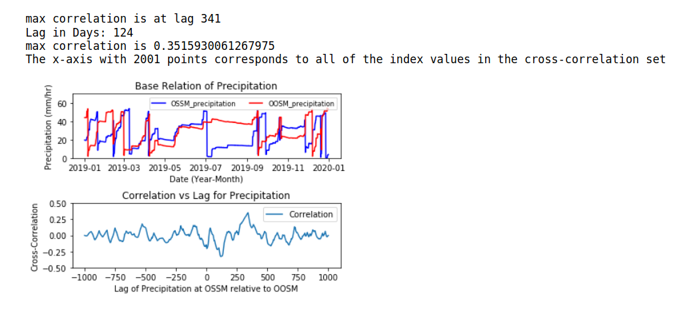
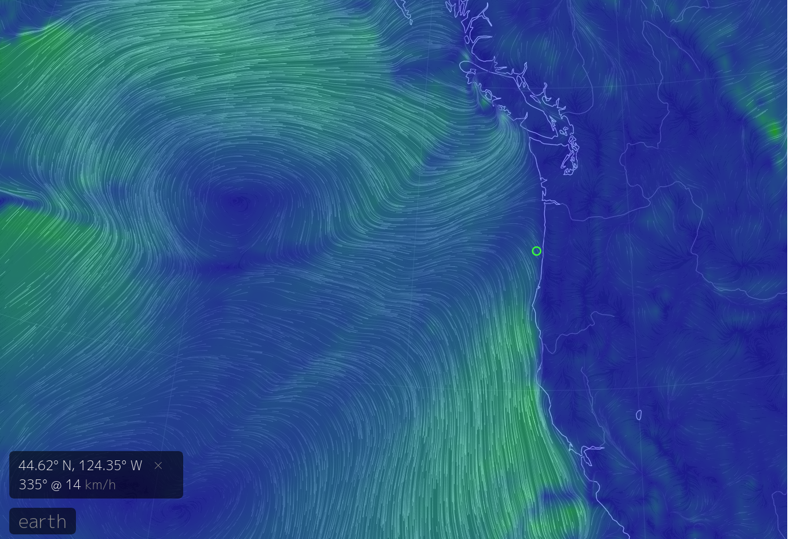

# CTD
Shan Siddiqui 
Dr. Abadi 
B ME 450 
2/21/20 

<b>Code Link: https://github.com/shansiddi/Meteorology-/blob/master/main.ipynb</b> 

<b>Introduction</b> 

The latest year of data was downloaded from the OOI of Oregon Shelf Surface Mooring and Oregon Offshore Surface Mooring [1]. The bulk meterology instrument package was selected. The bulk meterology instrument package characterizes weather conditions above the sea surface. Wind speed and rain rate were analyzed over the course of a year for the two locations. Oregon shelf surface mooring was at 44.6393 degrees North and 124.304 degrees West. Oregon offshore surface mooring was at 44.3811 degrees North and 124.956 degrees West. The distance between the two sites was 59.14 kilometers. Relationships between wind and precipitation at the two sites were found through the following problems.

Problem 1) For each site, plot wind speed (in m/s) and rain rate (in mm/hr) Find these time windows: when it is windy and rainy, when it is rainy but not windy, when it is windy but not rainy, when it is not windy not rainy. Show each time period on 
your plot (for example, use different colors and have a legend to show which region each color represents)

Problem 2) Plot the cross-correlation function between wind speed at both sites. What is the highest correlation? What is the time lag?

Problem 3) Plot the cross-correlation function between rain at both sites. What is the highest correlation? What is the time lag?

Problem 4) Is there any relationship between the time lag of wind speed and rain rate? 

Problem 5) In another plot, calculate and plot the monthly average of the wind speed and rain rate
for each site
What pattern do you see? Explain.
Which month had the highest rain rate? 
Which month had the lowest rain rate?
Which month had the highest wind speed?
Which month had the lowest wind speed?

<b>Methods</b> 

Python scripts in Jupyter Notebook were written to address the problems. See link at top of readme for complete code.

Method 1) Data was loaded into the environment via OOI's M@M interface. Time, rain rate, and wind speed were pulled from the data source and sorted. Time was converted to datetime. Data was split into the following cases when it is windy and rainy, when it is rainy but not windy, when it is windy but not rainy, when it is not windy not rainy. Rain rate and wind speed were plotted on a scatter plot. Cases were represented with axvspan which draws color bars in the background of the plot.

Method 2) np.correlate was used to compute covariance of the data at the Oregon shore and offshore wind. After computing correlation, with the covariance and standard deviation of the two sets; correlation was plotted against lags. The method for computing calculation was found from the University of Hawaii [2].

Method 3) np.correlate was used to compute covariance of the data at the Oregon shore and offshore rain. After computing correlation, with the covariance and standard deviation of the two sets; correlation was plotted against lags. The method for computing calculation was found from the University of Hawaii [2].

Method 4) To find a relationship between time lag of wind speed and rain rate at the two lags were compared. The distance between the two instruments was factored in to guage wind speed. Visual data of wind from EarthWindMap was considered to ground relationships against another source of data [3].

Method 5) An averaging function was used to first split the data into months then find monthly averages. Average data was plotted for each site and analyzed.

<b>Results</b> 

Results 1) The python script split the data into the desired cases of wind or rain. See figure 1 for the plots produced.

<b>figure 1: Rain Rate and Wind Versus Time for Both Sites</b> 
  
Results 2) Wind at the two sites were indistinguishible in the data. The correlation shows a peak correlation of 0.63 at a lag of 0. Indicating that the two data sets vary similarly suggestive of the wind being part of a single gust of wind in a sense. See figure 2 for the correlation comparison of the offshore and shelf data for wind. Earth wind vector map in part 4 expanded on the idea of a single gust of wind moving weather systems from offshore to shelf.

<b>figure 2: Wind Correlation</b> 
  
Results 3) On the other hand, rain rate does not correlate as strongly as wind did. But, a max correlation of 0.35 was observed at a lag of 124 days. Rainy weather systems may take time to move from one site to the other, average data for rain comparing the two sites supported the idea of lagging weather systems. Oregon shelf experiences similar weather to the offshore location, but with a lag. Because a constant wind system blows over the two the lagging rain system is produced. See figure 3 for the correlation comparison of the offshore and shelf data for rain.

<b>figure 3: Rain Rate Correlation</b> 
  
Results 4) Building upon the obervations of the previous problems we now find indications in data which suggest Oregon shelf precipitation lags behind Oregon offshore. From the lags alone as shown in figure 4 no clear relationship emerges. But, a zero lag in wind would indicate a constant flow of air through the offshore site to the shelf. Turing our attention to figures 5 and 6 it appears that this is in fact the case, a constant pressure system carries weather from offshore to the shelf. In figures 5 and 6 that pressure system is observable West of the two sites. 

<b>figure 4: Lags of Wind and Rain</b> 
  

<b>figure 5: Vector Map Shelf[3]</b> 
  

<b>figure 6: Vector Map Offshore[3]</b>   
  
Results 5) Finally, in plotting the average wind velocities the two sites are shown to change very closely. The similar waveform is consistent with the high covariance and correlation at zero time lag. Using the waveform analogy again for the precipitation one can observe similar magnitude but seperate phases for the two sites. Offshore precipitation peaks in June and has a minimum in October. Shelf precipitation peaks in July and has a mimimum in June. As far as wind speed goes Offshore wind peaks in March, September, and December and so does Shelf. Again suggesting that the wind offshore is the same as the wind at the shelf. See figure 7 for the plots of the monthly averages.

<b>figure 7: Monthly Averages [3]</b> 

<b>Conclusions</b> 
Through the covariance, correlation, and average comparison of wind and precipitation data at the Oregon offshore and shelf sites a weather system highway was found. Although the precipitation "waveforms" did not line up exactly, some similarities in the average peaks, namely the June for offshore and the July for shelf, suggests that weather systems travel from one location to the other. The wind data at the two sites was found to correlate strongly (0.63) between the two sites which are approximately 59 km apart. If the wind runs in the same direction then a common weather system can travel along this path. A precipitation correlation of 0.35 with a time lag of 124 days supports this conclusion.    

References

[1] NSF Ocean Observatories Initiative Data Portal, http://ooinet.oceanobservatories.org. Downloaded on (2/21/20).

[2] “Correlation¶,” SEM_EDOF. [Online]. Available: https://currents.soest.hawaii.edu/ocn_data_analysis/_static/SEM_EDOF.html. [Accessed: 21-Feb-2020].

[3] C. Beccario, “a global map of wind, weather, and ocean conditions,” earth. [Online]. Available: https://earth.nullschool.net/. [Accessed: 21-Feb-2020].
